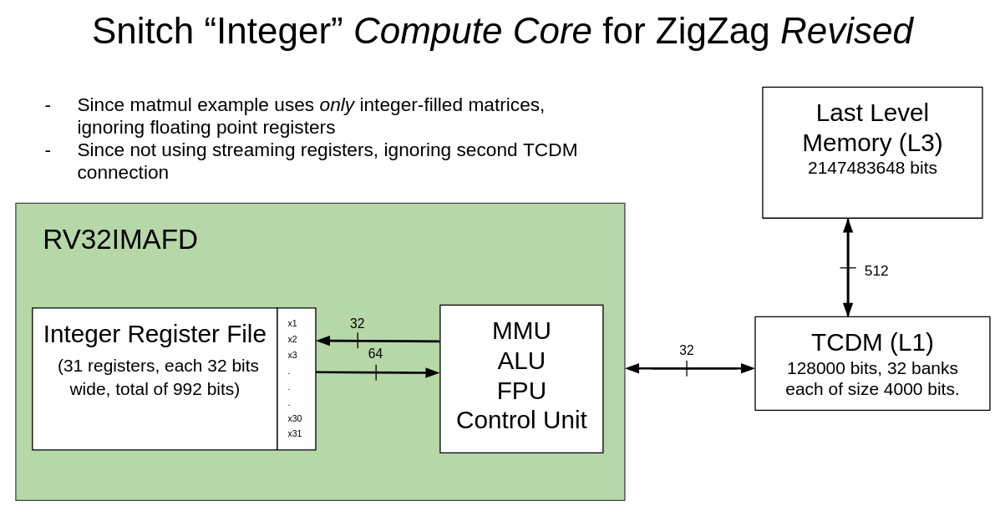
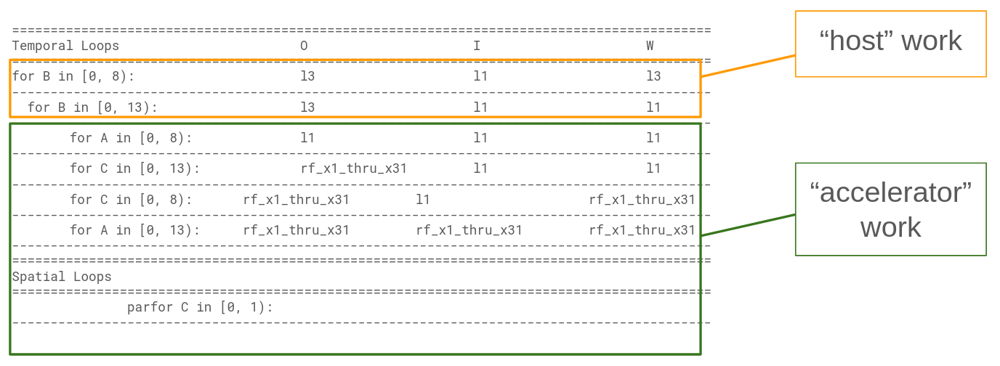

# Matrix Multiplication 11

- This example runs tiled matrix multiplication on a snitch compute core.
- Tiling scheme is chosen by ZigZag using a [snitch compute core](https://github.com/EmilySillars/zigzag/blob/manual-examples/zigzag/inputs/hardware/snitch-cc-only-integers.yaml) hardware description.
- Dynamically Allocated Input
- Matrix size 104 x 104

[back to all tests](../../../zigzag-fork/README.md#Examples)

## I. Input to ZigZag

#### a. MLIR (someday, use linalg-to-stream tool to convert to yaml...)

```
// matrices are 104 x 104
#map = affine_map<(d0, d1, d2) -> (d0, d2)>
#map1 = affine_map<(d0, d1, d2) -> (d2, d1)>
#map2 = affine_map<(d0, d1, d2) -> ()>
#map3 = affine_map<(d0, d1, d2) -> (d0, d1)>
"builtin.module"() ({
 
"func.func"() <{function_type = (memref<104x104xi8>, memref<104x104xi8, strided<[1, 104]>>, memref<104x104xi32>) -> (), sym_name = "simple_matmul"}> ({
  ^bb0(%arg0: memref<104x104xi8>, %arg1: memref<104x104xi8, strided<[1, 104]>>, %arg2: memref<104x104xi32>):
    %0 = "arith.constant"() <{value = 0 : i32}> : () -> i32
    "linalg.generic"(%arg0, %arg1, %0, %0, %arg2) <{indexing_maps = [affine_map<(d0, d1, d2) -> (d0, d2)>, affine_map<(d0, d1, d2) -> (d2, d1)>, affine_map<(d0, d1, d2) -> ()>, affine_map<(d0, d1, d2) -> ()>, affine_map<(d0, d1, d2) -> (d0, d1)>], iterator_types = [#linalg.iterator_type<parallel>, #linalg.iterator_type<parallel>, #linalg.iterator_type<reduction>], operandSegmentSizes = array<i32: 4, 1>}> ({
    ^bb0(%arg3: i8, %arg4: i8, %arg5: i32, %arg6: i32, %arg7: i32):
      %1 = "arith.extsi"(%arg3) : (i8) -> i32
      %2 = "arith.subi"(%1, %arg5)  : (i32, i32) -> i32
      %3 = "arith.extsi"(%arg4) : (i8) -> i32
      %4 = "arith.subi"(%3, %arg6)  : (i32, i32) -> i32
      %5 = "arith.muli"(%2, %4)  : (i32, i32) -> i32
      %6 = "arith.addi"(%arg7, %5) : (i32, i32) -> i32
      "linalg.yield"(%6) : (i32) -> ()
    }) : (memref<104x104xi8>, memref<104x104xi8, strided<[1, 104]>>, i32, i32, memref<104x104xi32>) -> ()
    "func.return"() : () -> ()
  }) {llvm.emit_c_interface} : () -> ()
  }) : () -> ()
```

#### b. Equivalent yaml Workload Object (directly passed to zigzag)

```
- id: 0 
  name: matmul_104_104  # name can be used to specify mapping
  operator_type: MatMul  # operator_type can be used to specify mapping
  equation: O[a][b]+=I[a][c]*W[c][b]
  dimension_relations: []
  loop_dims: [A,B,C]
  loop_sizes: [104, 104, 104]
  operand_precision:
    W: 8
    I: 8
    O: 32
    O_final: 32
  operand_source:
    I: 0
    W: 0
```

#### c. C code Equivalent (cannot feed to zigzag; just for reference)

C-ish pseudocode (ignoring sign extension and subtracting 0 instructions)

```
for d0; d0 < 104; d0++:
for d1; d1 < 104; d1++;
for d2; d2 < 104; d2++;
  arg7[d0][d1] += arg3[d0][d2] * arg4[d2][d1]; // and this is a MAC!
```

#### d. Hardware Description



- [This is the yaml fed to ZigZag](https://github.com/EmilySillars/zigzag/blob/manual-examples/zigzag/inputs/hardware/snitch-cc-only-integers.yaml)

- Full documentation of feeding to ZigZag and getting output [here](https://github.com/EmilySillars/zigzag/blob/manual-examples/emily-notes.md#single-snitch-compute-core).

## II. Output from ZigZag

```
===========================================================================================
Temporal Loops                    O                  I                  W                  
===========================================================================================
for B in [0, 8):                  l3                 l1                 l3                 
-------------------------------------------------------------------------------------------
  for B in [0, 13):               l3                 l1                 l1                 
-------------------------------------------------------------------------------------------
    for A in [0, 8):              l1                 l1                 l1                 
-------------------------------------------------------------------------------------------
      for C in [0, 13):           rf_x1_thru_x31     l1                 l1                 
-------------------------------------------------------------------------------------------
        for C in [0, 8):          rf_x1_thru_x31     l1                 rf_x1_thru_x31     
-------------------------------------------------------------------------------------------
          for A in [0, 13):       rf_x1_thru_x31     rf_x1_thru_x31     rf_x1_thru_x31     
-------------------------------------------------------------------------------------------
===========================================================================================
Spatial Loops                                                                              
===========================================================================================
            parfor C in [0, 1):                                                            
-------------------------------------------------------------------------------------------
```

I used wrong mapping file! Running with correct (empty) mapping file, we get:

```
Loop ordering for matmul_104_104
===========================================================================================
Temporal Loops                    I                  O                  W                  
===========================================================================================
for B in [0, 8):                  l1                 l3                 l3                 
-------------------------------------------------------------------------------------------
  for B in [0, 13):               l1                 l3                 l1                 
-------------------------------------------------------------------------------------------
    for A in [0, 8):              l1                 l1                 l1                 
-------------------------------------------------------------------------------------------
      for C in [0, 13):           l1                 rf_x1_thru_x31     l1                 
-------------------------------------------------------------------------------------------
        for C in [0, 8):          l1                 rf_x1_thru_x31     rf_x1_thru_x31     
-------------------------------------------------------------------------------------------
          for A in [0, 13):       rf_x1_thru_x31     rf_x1_thru_x31     rf_x1_thru_x31     
-------------------------------------------------------------------------------------------
===========================================================================================
Spatial Loops                                                                              
===========================================================================================
            parfor B in [0, 1):                                                            
-------------------------------------------------------------------------------------------

Stall and slack per port of each memory instance:
  rf_x1_thru_x31: {'r_port_1': 1222192, 'w_port_1': 0}
  l1: {'rw_port_1': 0}
  l3: {'rw_port_1': 0}
Latency: 2.350e+06
```

Need to edit this example based on the results!!!

## III. Manual Transformation

#### a. C-ish pseudo code transformed

```
b_0_bk_sz = 13;
a_0_bk_sz = 13;
c_0_bk_sz = 8;

for (b_0 = 0; b_0 < 8; b_0++) {
 for (b_1 = 0; b_1 < 13; b_1++) {
   for (a_0 = 0; a_0 < 8; a_0++) { 
    for (c_0 = 0; c_0 < 13; c_0++) {
     for (c_1 = 0; c_1 < 8; c_1 ++) {
      for (a_1 = 0; a_1 < 13; a_1++) {
        a = a_0 * a_0_bk_sz + a_1;
        b = b_0 * b_0_bk_sz + b_1
        c = c_0 * c_0_bk_sz + c_1
      	O[a][b]+=I[a][c]*W[c][b]
      }
     }
    }
   }
 }
}
```

#### b. MLIR transformed

```
TODO
```

#### c. MLIR transformed based on L1 - L3 split ("host" vs "accelerator" divide)



Host:

```
// perform tiled matrix multiplication,
// dispatching part of the work to the accelerator!
  "func.func"() <{function_type = 
  (memref<104x104xi8>,                        // arg0 (input)
   memref<104x104xi8, strided<[1, 104]>>,     // arg1 (weight)
   memref<104x104xi32, strided<[104,1]>>,     // arg2 (output)
   memref<104x104xi32, strided<[104,1]>>,     // arg3 (output space on l1)
   memref<104x104xi8, strided<[1, 104]>>      // arg4 (weight space on l1)
  ) -> (), sym_name = "pineapple"}> ({
  ^bb0(%arg0: memref<104x104xi8>, 
       %arg1: memref<104x104xi8, strided<[1,104]>>, 
       %arg2: memref<104x104xi32, strided<[104,1]>>, 
       %outputL1: memref<104x104xi32, strided<[104,1]>>,
       %weightL1: memref<104x104xi8, strided<[1,104]>>): 

    // indices
    %zero = arith.constant 0 : index
    %one = arith.constant 1: index
    %eight = arith.constant 8 : index
    %thirteen = arith.constant 13 : index  
    %oneOhFour = arith.constant 104 : index
 
    %b0_0_bk_sz = arith.constant 13 : index
    //%b1_0_bk_sz = arith.constant 8: index
   
    // constants
    %zero_i32 = arith.constant 0: i32
    %sixTwentyFour_i32 = arith.constant 624: i32
    %one_i32 = arith.constant 1 : i32

    // enter scf FOR LOOP
    // select vertical slices of O and W with dimensions (104 x 13)
    scf.for %b0_0 = %zero to %eight step %one iter_args() -> () { // this loop uses both L3 and L1    
    %b0 = arith.muli %b0_0, %b0_0_bk_sz : index   

    // Output Operand 
    // slice of L3 Output @(104x13)
    %verticalSliceOL3 = memref.subview %arg2[%zero, %b0][104,13][1,1] 
    :  memref<104x104xi32, strided<[104,1]>> to memref<104x13xi32, strided<[104, 1], offset: ?>>
    // slice of L1 Output @(104x13)
    %verticalSliceOL1 = memref.subview %outputL1[%zero,%zero][104,13][1,1]
    : memref<104x104xi32, strided<[104,1]>> to memref<104x13xi32, strided<[104,1], offset: ?>>

    // Weight Operand
    // slice of L3 Weight @(104x13)
    %verticalSliceWL3 = memref.subview %arg1[%zero, %b0][104,13][1,1] 
    :  memref<104x104xi8, strided<[1, 104]>> to memref<104x13xi8, strided<[1, 104], offset: ?>>
    // slice of L1 Weight @(104x13)
    %verticalSliceWL1 = memref.subview %weightL1[%zero, %zero][104,13][1,1] 
    :  memref<104x104xi8, strided<[1, 104]>> to memref<104x13xi8, strided<[1, 104], offset: ?>>
    // copy L3 Weight to L1
    func.call @memrefCopy8bit(%verticalSliceWL3,  %verticalSliceWL1) 
    : (memref<104x13xi8, strided<[1, 104], offset: ?>>, memref<104x13xi8, strided<[1, 104], offset: ?>>) -> ()
    
    // enter scf FOR LOOP
    // select vertical slices of each of O and W's vertical slices with dimensions (104x1) 
    scf.for %b1_0 = %zero to %thirteen step %one iter_args() -> () { // this loop uses both L3 and L1
        
    // slice of slice of L3 Output @(104x1)
    %vSliceOL3 = memref.subview %verticalSliceOL3[%zero, %b1_0][104,1][1,1] 
    :  memref<104x13xi32, strided<[104, 1], offset: ?>> to memref<104x1xi32, strided<[104, 1], offset: ?>>
    // slice of L1 output @(104x1)
    %vSliceOL1 = memref.subview %verticalSliceOL1[%zero, %b1_0][104,1][1,1]
    : memref<104x13xi32, strided<[104, 1], offset: ?>> to memref<104x1xi32, strided<[104, 1], offset: ?>>
    // copy L3 Output to L1
    func.call @memrefCopy32bit(%vSliceOL3,%vSliceOL1) : 
    (memref<104x1xi32, strided<[104, 1], offset: ?>>, memref<104x1xi32, strided<[104, 1], offset: ?>>) -> ()
    
    // slice of L1 Weight @(104x1)
    %vSliceWL1 = memref.subview %verticalSliceWL1[%zero,%b1_0][104,1][1,1]
    : memref<104x13xi8, strided<[1, 104], offset: ?>> to memref<104x1xi8, strided<[1, 104], offset: ?>> 

    func.call @dispatch_to_accelerator(%zero_i32, %arg0, %vSliceWL1, %vSliceOL1)
    : (
    i32, // coreID
    memref<104x104xi8>, // input
    memref<104x1xi8, strided<[1, 104], offset: ?>>,   // weight slice
    memref<104x1xi32, strided<[104, 1], offset: ?>>)  // output slice
    -> ()

    // copy Output L1 back to L3
    func.call @memrefCopy32bit(%vSliceOL1,%vSliceOL3) : 
    (memref<104x1xi32, strided<[104, 1], offset: ?>>, memref<104x1xi32, strided<[104, 1], offset: ?>>) -> ()
    
    // zero-out the Output L1 slice; there has to be a better way to do this, right?
    scf.for %i = %zero to %oneOhFour step %one iter_args() -> () { 
     memref.store %zero_i32, %vSliceOL1[%i, %zero] : memref<104x1xi32, strided<[104, 1], offset: ?>>
    } // end of %i for

    } // end of b1_0 for
    } // end of b0_0 for
    "func.return"() : () -> ()
  }) {llvm.emit_c_interface}: () -> ()
```

Accelerator:

```
  // computation performed by accelerator as part of tiled matmul
  "func.func"() <{function_type = (
    memref<104x104xi8, strided<[104, 1], offset: ?>>, // input
    memref<104x1xi8, strided<[1, 104], offset: ?>>,   // weight slice
    memref<104x1xi32, strided<[104, 1], offset: ?>>)  // output slice
    -> (), sym_name = "mango"}> ({
  ^bb0(
    %arg0: memref<104x104xi8, strided<[104, 1], offset: ?>>, 
    %arg1: memref<104x1xi8, strided<[1, 104], offset: ?>>, 
    %arg2: memref<104x1xi32, strided<[104, 1], offset: ?>>):

    // tile sizes
    %a0_0_bk_sz = arith.constant 13 : index
    %c0_0_bk_sz = arith.constant 8 : index
    
    // indices
    %zero = arith.constant 0 : index
    %one = arith.constant 1: index
    %eight = arith.constant 8 : index
    %thirteen = arith.constant 13 : index

    //constants
    %sixTwentyFour_i32 = arith.constant 624: i32
    %one_i32 = arith.constant 1 : i32

    // all the following inner loops should be executed on the accelerator
    scf.for %a0_0 = %zero to %eight step %one iter_args() -> () {  
    scf.for %c0_0 = %zero to %thirteen step %one iter_args () -> () {
    scf.for %c1_0 = %zero to %eight step %one iter_args() -> () {       
    scf.for %a1_0 = %zero to %thirteen step %one iter_args () -> () { 
      
      %prod0 = arith.muli %a0_0, %a0_0_bk_sz : index
      %a0 = arith.addi %prod0, %a1_0 : index

      %b0 = arith.constant 0 : index

      %prod1 = arith.muli %c0_0, %c0_0_bk_sz : index
      %c0 = arith.addi %prod1, %c1_0 : index

      // O[a][b]+=I[a][c]*W[c][b]
     
      %inputElt = memref.load %arg0[%a0, %c0] : memref<104x104xi8, strided<[104, 1], offset: ?>>
      %inputEltCasted = arith.extsi  %inputElt : i8 to i32 
      
      %weightElt = memref.load %arg1[%c0, %b0] : memref<104x1xi8, strided<[1, 104], offset: ?>>
      %weightEltCasted = arith.extsi  %weightElt : i8 to i32 

      %outputElt = memref.load %arg2[%a0, %b0] : memref<104x1xi32, strided<[104, 1], offset: ?>>
      %prod = arith.muli %inputEltCasted, %weightEltCasted : i32
      
      %newOutputElt = arith.addi %prod, %outputElt : i32 
      memref.store %newOutputElt, %arg2[%a0, %b0] : memref<104x1xi32, strided<[104, 1], offset: ?>> 
    } // end of d1_2 for
    } // end of d0_2 for
    } // end of d2_1 for
    } // end of d1_1 for
    "func.return"() : () -> ()
  }) {llvm.emit_c_interface}: () -> ()
```

## IV. Running the transformed MLIR on Snitch

```
cd runtime/tests
```

spike: 

```
sh zigzag-spike-build-and-run.sh tiledMatmul11.mlir
```

verilator:

```
sh zigzag-verilator-build-and-run.sh tiledMatmul11.mlir
```

