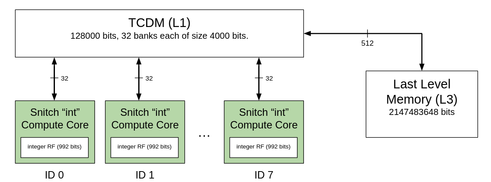

# Matrix Multiplication 12

- This example runs tiled matrix multiplication on a snitch cluster of 8 compute cores.
- Tiling scheme is chosen by ZigZag using a [snitch cluster](https://github.com/EmilySillars/zigzag/blob/manual-examples/zigzag/inputs/hardware/snitch-cluster-only-integers.yaml) hardware description.
- Dynamically Allocated Input
- Matrix size 104 x 104

[back to all tests](../../../zigzag-fork/README.md#Examples)

## I. Input to ZigZag

#### a. MLIR (someday, use linalg-to-stream tool to convert to yaml...)

```
// matrices are 104 x 104
#map = affine_map<(d0, d1, d2) -> (d0, d2)>
#map1 = affine_map<(d0, d1, d2) -> (d2, d1)>
#map2 = affine_map<(d0, d1, d2) -> ()>
#map3 = affine_map<(d0, d1, d2) -> (d0, d1)>
"builtin.module"() ({
 
"func.func"() <{function_type = (memref<104x104xi8>, memref<104x104xi8, strided<[1, 104]>>, memref<104x104xi32>) -> (), sym_name = "simple_matmul"}> ({
  ^bb0(%arg0: memref<104x104xi8>, %arg1: memref<104x104xi8, strided<[1, 104]>>, %arg2: memref<104x104xi32>):
    %0 = "arith.constant"() <{value = 0 : i32}> : () -> i32
    "linalg.generic"(%arg0, %arg1, %0, %0, %arg2) <{indexing_maps = [affine_map<(d0, d1, d2) -> (d0, d2)>, affine_map<(d0, d1, d2) -> (d2, d1)>, affine_map<(d0, d1, d2) -> ()>, affine_map<(d0, d1, d2) -> ()>, affine_map<(d0, d1, d2) -> (d0, d1)>], iterator_types = [#linalg.iterator_type<parallel>, #linalg.iterator_type<parallel>, #linalg.iterator_type<reduction>], operandSegmentSizes = array<i32: 4, 1>}> ({
    ^bb0(%arg3: i8, %arg4: i8, %arg5: i32, %arg6: i32, %arg7: i32):
      %1 = "arith.extsi"(%arg3) : (i8) -> i32
      %2 = "arith.subi"(%1, %arg5)  : (i32, i32) -> i32
      %3 = "arith.extsi"(%arg4) : (i8) -> i32
      %4 = "arith.subi"(%3, %arg6)  : (i32, i32) -> i32
      %5 = "arith.muli"(%2, %4)  : (i32, i32) -> i32
      %6 = "arith.addi"(%arg7, %5) : (i32, i32) -> i32
      "linalg.yield"(%6) : (i32) -> ()
    }) : (memref<104x104xi8>, memref<104x104xi8, strided<[1, 104]>>, i32, i32, memref<104x104xi32>) -> ()
    "func.return"() : () -> ()
  }) {llvm.emit_c_interface} : () -> ()
  }) : () -> ()
```

#### b. Equivalent yaml Workload Object (directly passed to zigzag)

```
- id: 0 
  name: matmul_104_104  # name can be used to specify mapping
  operator_type: MatMul  # operator_type can be used to specify mapping
  equation: O[a][b]+=I[a][c]*W[c][b]
  dimension_relations: []
  loop_dims: [A,B,C]
  loop_sizes: [104, 104, 104]
  operand_precision:
    W: 8
    I: 8
    O: 32
    O_final: 32
  operand_source:
    I: 0
    W: 0
```

#### c. C code Equivalent (cannot feed to zigzag; just for reference)

C-ish pseudocode (ignoring sign extension and subtracting 0 instructions)

```
for d0; d0 < 104; d0++:
for d1; d1 < 104; d1++;
for d2; d2 < 104; d2++;
  arg7[d0][d1] += arg3[d0][d2] * arg4[d2][d1]; // and this is a MAC!
```

#### d. Snitch Compute Core Hardware Description



- [This is the yaml fed to ZigZag](https://github.com/EmilySillars/zigzag/blob/manual-examples/zigzag/inputs/hardware/snitch-cluster-only-integers.yaml)

- Full documentation of feeding to ZigZag and getting output [here](https://github.com/EmilySillars/zigzag/blob/manual-examples/emily-notes.md#snitch-cluster).

## II. Output from ZigZag

```
=============================================================================================
Temporal Loops                      O                  I                  W                  
=============================================================================================
for A in [0, 13):                   l3                 l1                 l1                 
---------------------------------------------------------------------------------------------
  for A in [0, 8):                  l1                 l1                 l1                 
---------------------------------------------------------------------------------------------
    for B in [0, 4):                l1                 rf_x1_thru_x31     l1                 
---------------------------------------------------------------------------------------------
      for C in [0, 13):             rf_x1_thru_x31     rf_x1_thru_x31     l1                 
---------------------------------------------------------------------------------------------
        for B in [0, 13):           rf_x1_thru_x31     rf_x1_thru_x31     l1                 
---------------------------------------------------------------------------------------------
          for B in [0, 2):          rf_x1_thru_x31     rf_x1_thru_x31     rf_x1_thru_x31     
---------------------------------------------------------------------------------------------
=============================================================================================
Spatial Loops                                                                                
=============================================================================================
            parfor C in [0, 8):                                                              
---------------------------------------------------------------------------------------------
            parfor C in [0, 1):                                                              
---------------------------------------------------------------------------------------------
```

## III. Manual Transformation

#### a. C code transformed

```
TODO
```

#### b. MLIR transformed

```
TODO
```

#### c. MLIR transformed based on L1 - L3 split ("host" vs "accelerator" divide)

Host:

```
TODO
```

Accelerator:

```
 TODO
```


## IV. Running the transformed MLIR on Snitch

```
cd runtime/tests
```

spike: 

```
sh zigzag-spike-build-and-run.sh tiledMatmul12.mlir
```

verilator:

```
sh zigzag-verilator-build-and-run.sh tiledMatmul12.mlir
```

