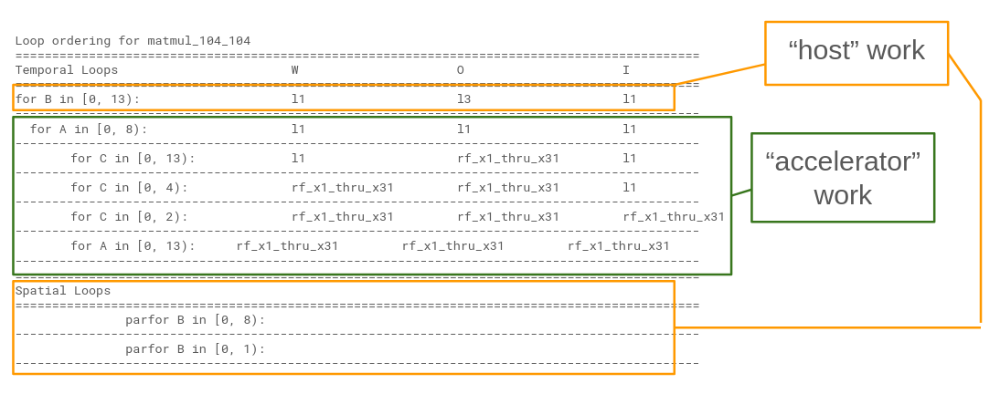

# Matrix Multiplication 12

- This example runs tiled matrix multiplication on a snitch cluster of 8 compute cores.
- Tiling scheme is chosen by ZigZag using a [snitch cluster](https://github.com/EmilySillars/zigzag/blob/manual-examples/zigzag/inputs/hardware/snitch-cluster-only-integers.yaml) hardware description.
- Dynamically Allocated Input
- Matrix size 104 x 104

[back to all tests](../../../zigzag-fork/README.md#Examples)

## I. Input to ZigZag

#### a. MLIR (someday, use linalg-to-stream tool to convert to yaml...)

```
// matrices are 104 x 104
#map = affine_map<(d0, d1, d2) -> (d0, d2)>
#map1 = affine_map<(d0, d1, d2) -> (d2, d1)>
#map2 = affine_map<(d0, d1, d2) -> ()>
#map3 = affine_map<(d0, d1, d2) -> (d0, d1)>
"builtin.module"() ({
 
"func.func"() <{function_type = (memref<104x104xi8>, memref<104x104xi8, strided<[1, 104]>>, memref<104x104xi32>) -> (), sym_name = "simple_matmul"}> ({
  ^bb0(%arg0: memref<104x104xi8>, %arg1: memref<104x104xi8, strided<[1, 104]>>, %arg2: memref<104x104xi32>):
    %0 = "arith.constant"() <{value = 0 : i32}> : () -> i32
    "linalg.generic"(%arg0, %arg1, %0, %0, %arg2) <{indexing_maps = [affine_map<(d0, d1, d2) -> (d0, d2)>, affine_map<(d0, d1, d2) -> (d2, d1)>, affine_map<(d0, d1, d2) -> ()>, affine_map<(d0, d1, d2) -> ()>, affine_map<(d0, d1, d2) -> (d0, d1)>], iterator_types = [#linalg.iterator_type<parallel>, #linalg.iterator_type<parallel>, #linalg.iterator_type<reduction>], operandSegmentSizes = array<i32: 4, 1>}> ({
    ^bb0(%arg3: i8, %arg4: i8, %arg5: i32, %arg6: i32, %arg7: i32):
      %1 = "arith.extsi"(%arg3) : (i8) -> i32
      %2 = "arith.subi"(%1, %arg5)  : (i32, i32) -> i32
      %3 = "arith.extsi"(%arg4) : (i8) -> i32
      %4 = "arith.subi"(%3, %arg6)  : (i32, i32) -> i32
      %5 = "arith.muli"(%2, %4)  : (i32, i32) -> i32
      %6 = "arith.addi"(%arg7, %5) : (i32, i32) -> i32
      "linalg.yield"(%6) : (i32) -> ()
    }) : (memref<104x104xi8>, memref<104x104xi8, strided<[1, 104]>>, i32, i32, memref<104x104xi32>) -> ()
    "func.return"() : () -> ()
  }) {llvm.emit_c_interface} : () -> ()
  }) : () -> ()
```

#### b. Equivalent yaml Workload Object (directly passed to zigzag)

```
- id: 0 
  name: matmul_104_104  # name can be used to specify mapping
  operator_type: MatMul  # operator_type can be used to specify mapping
  equation: O[a][b]+=I[a][c]*W[c][b]
  dimension_relations: []
  loop_dims: [A,B,C]
  loop_sizes: [104, 104, 104]
  operand_precision:
    W: 8
    I: 8
    O: 32
    O_final: 32
  operand_source:
    I: 0
    W: 0
```

#### c. C code Equivalent (cannot feed to zigzag; just for reference)

C-ish pseudocode (ignoring sign extension and subtracting 0 instructions)

```
for d0; d0 < 104; d0++:
for d1; d1 < 104; d1++;
for d2; d2 < 104; d2++;
  arg7[d0][d1] += arg3[d0][d2] * arg4[d2][d1]; // and this is a MAC!
```

#### d. Snitch Compute Core Hardware Description


- [This is the yaml fed to ZigZag](https://github.com/EmilySillars/zigzag/blob/manual-examples/zigzag/inputs/hardware/snitch-cluster-only-integers.yaml)

- Full documentation of feeding to ZigZag and getting output [here](https://github.com/EmilySillars/zigzag/blob/58e38adf8191e2b983c5e0ec97480ed97ef797dd/modeling-snitch-with-zigzag.md).

## II. Output from ZigZag

```
Loop ordering for matmul_104_104
=============================================================================================
Temporal Loops                      W                  O                  I                  
=============================================================================================
for B in [0, 13):                   l1                 l3                 l1                 
---------------------------------------------------------------------------------------------
  for A in [0, 8):                  l1                 l1                 l1                 
---------------------------------------------------------------------------------------------
    for C in [0, 13):               l1                 rf_x1_thru_x31     l1                 
---------------------------------------------------------------------------------------------
      for C in [0, 4):              rf_x1_thru_x31     rf_x1_thru_x31     l1                 
---------------------------------------------------------------------------------------------
        for C in [0, 2):            rf_x1_thru_x31     rf_x1_thru_x31     rf_x1_thru_x31     
---------------------------------------------------------------------------------------------
          for A in [0, 13):         rf_x1_thru_x31     rf_x1_thru_x31     rf_x1_thru_x31     
---------------------------------------------------------------------------------------------
=============================================================================================
Spatial Loops                                                                                
=============================================================================================
            parfor B in [0, 8):                                                              
---------------------------------------------------------------------------------------------
            parfor B in [0, 1):                                                              
---------------------------------------------------------------------------------------------
```



## III. Manual Transformation

#### a. C-ish pseudocode transformed based on "host vs. accelerator" divide

Host:

```
void dmaCore (Matrix_104x104 i, Matrix_104x104 w, Matrix_104x104 o) {
    // loop bounds
    size_t B_S = 8;

    // block sizes
    size_t b_s_bk_sz = 13;
    
	// assume i and w are already in L1, and o is in L3
    for (size_t b_s = 0; b_s < B_S; b_s++) {
        size_t start = b_s * b_s_bk_sz;
        Shape shape = 104x13;
        Matrix_104_13 w_tile = subtile(w, start, shape);
        Matrix_104_13 o_tile = subtile(o, start, shape);
        
        // copy o_tile from L3 to L1
        Matrix_104_13 o_tile_L1;
        copyFromL3(o_tile, o_tile_L1);
        
        // deploy rest of work on compute core with id b_s
		computeCore(i, w_tile, o_tile_L1, b_s);
		
		// copy o_tile from L1 back to L3
		copyFromL1(o_tile_L1, o_tile);
    }
}
```

Accelerator:

```
// recall:  O[a][b]+=I[a][c]*W[c][b]
// this example does not differentiate between L1 and registers, 
// because will not model register level loads at this level, nor the MLIR level

void computeCore (Matrix_104x104 i, Matrix_104x13 w, Matrix_104x13 o, int coreID) {
	if (myCoreId() != coreID) { return; }
	
	// loop bounds
	size_t B_0 = 13;
	size_t A_0 = 8;
    size_t C_0 = 13;
    size_t C_1 = 4;
    size_t C_2 = 2;
    size_t A_1 = 13;
    
	// loop blocks
	size_t b_0_bk_sz = 1;
	size_t a_0_bk_sz = 13;
	size_t c_0_bk_sz = 8;
	size_t c_1_bk_sz = 2;
	size_t c_2_bk_sz = 1;
	size_t a_1_bk_sz = 1;
	
	for (size_t b_0 = 0; b_0 < B_0; b_0++) {
		size_t start = b_0 * b_0_bk_sz;
		Matrix_104_1 o_tile = subtile(o, start, 104x1)
		Matrix_104_1 w_tile = subtile(w, start, 104x1)		
        for (size_t a_0 = 0; a_0 < A_0; a_0++) {
            start = a_0 * a_0_bk_sz;
            Matrix_13_104 i_tile = subtile(i, start, 13x104);
            Matrix_13_1 o_tile_tile = subtile(o_tile, start, 13x1);	
            for (size_t c_0 = 0; c_0 < C_0; c_0++) {
                start = c_0 * c_0_bk_sz;
                Matrix_13_8 i_tile_tile = subtile(i_tile, start, 13x8);
                Matrix_13_13 w_tile_tile = subtile(w_tile, start, 8x1);
                for (size_t c_1 = 0; c_1 < C_1; c_1++) {
                	start = c_1 * c_1_bk_sz;
                	Matrix_13_2 i_tile_tile_tile = subtile(i_tile_tile, start, 13x2);
                	Matrix_2_1 w_tile_tile_tile - subtile(w_tile_tile, start, 2x1);
                    for (size_t c_2 = 0; c_2 < C_2; c_2++) {
                    	start = c_2 * c_2_bk_sz;
                    	Matrix_13x1 i_tile_4 = subtile(i_tile_tile_tile, start, 13x1);
                    	Matrix_1_1 w_tile_4 = subtile(w_tile_tile_tile, start, 1x1);                    
                        for (size_t a_1 = 0; a_1 < A_1; a_1++) {
                        	start = a_1 * a_1_bk_sz;
                        	Matrix_1_1 i_tile_5 = subtile(i_tile_4, start, 1x1);
                        	Matrix_1_1 o_tile_3 = subtile(o_tile_tile, start, 1x1)
                        	o_tile_3 += (i_tile_5 * w_tile_4);
                        }
                    }
                }
            }
        }
	}
}
```

#### c. MLIR transformed based on L1 - L3 split ("host" vs "accelerator" divide)

Host:

```
TODO
```

Accelerator:

```
 TODO
```

## IV. Running the transformed MLIR on Snitch

```
cd runtime/tests
```

spike: 

```
sh zigzag-spike-build-and-run.sh tiledMatmul12.mlir
```

verilator:

```
sh zigzag-verilator-build-and-run.sh tiledMatmul12.mlir
```

