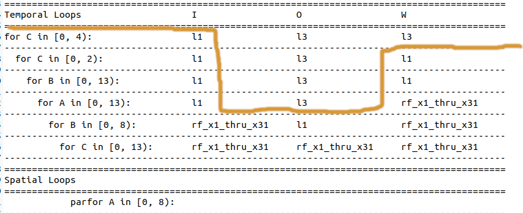

# Matrix Multiplication 12

- This example runs tiled matrix multiplication on a snitch cluster of 8 compute cores.
- Tiling scheme is chosen by ZigZag using a [snitch cluster](https://github.com/EmilySillars/zigzag/blob/manual-examples/zigzag/inputs/hardware/snitch-cluster-only-integers.yaml) hardware description.
- Dynamically Allocated Input
- Matrix size 104 x 104

[back to all tests](../../../zigzag-fork/README.md#Examples)

## I. Input to ZigZag

#### a. MLIR (someday, use linalg-to-stream tool to convert to yaml...)

```
// matrices are 104 x 104
#map = affine_map<(d0, d1, d2) -> (d0, d2)>
#map1 = affine_map<(d0, d1, d2) -> (d2, d1)>
#map2 = affine_map<(d0, d1, d2) -> ()>
#map3 = affine_map<(d0, d1, d2) -> (d0, d1)>
"builtin.module"() ({
 
"func.func"() <{function_type = (memref<104x104xi8>, memref<104x104xi8, strided<[1, 104]>>, memref<104x104xi32>) -> (), sym_name = "simple_matmul"}> ({
  ^bb0(%arg0: memref<104x104xi8>, %arg1: memref<104x104xi8, strided<[1, 104]>>, %arg2: memref<104x104xi32>):
    %0 = "arith.constant"() <{value = 0 : i32}> : () -> i32
    "linalg.generic"(%arg0, %arg1, %0, %0, %arg2) <{indexing_maps = [affine_map<(d0, d1, d2) -> (d0, d2)>, affine_map<(d0, d1, d2) -> (d2, d1)>, affine_map<(d0, d1, d2) -> ()>, affine_map<(d0, d1, d2) -> ()>, affine_map<(d0, d1, d2) -> (d0, d1)>], iterator_types = [#linalg.iterator_type<parallel>, #linalg.iterator_type<parallel>, #linalg.iterator_type<reduction>], operandSegmentSizes = array<i32: 4, 1>}> ({
    ^bb0(%arg3: i8, %arg4: i8, %arg5: i32, %arg6: i32, %arg7: i32):
      %1 = "arith.extsi"(%arg3) : (i8) -> i32
      %2 = "arith.subi"(%1, %arg5)  : (i32, i32) -> i32
      %3 = "arith.extsi"(%arg4) : (i8) -> i32
      %4 = "arith.subi"(%3, %arg6)  : (i32, i32) -> i32
      %5 = "arith.muli"(%2, %4)  : (i32, i32) -> i32
      %6 = "arith.addi"(%arg7, %5) : (i32, i32) -> i32
      "linalg.yield"(%6) : (i32) -> ()
    }) : (memref<104x104xi8>, memref<104x104xi8, strided<[1, 104]>>, i32, i32, memref<104x104xi32>) -> ()
    "func.return"() : () -> ()
  }) {llvm.emit_c_interface} : () -> ()
  }) : () -> ()
```

#### b. Equivalent yaml Workload Object (directly passed to zigzag)

```
- id: 0 
  name: matmul_104_104  # name can be used to specify mapping
  operator_type: MatMul  # operator_type can be used to specify mapping
  equation: O[a][b]+=I[a][c]*W[c][b]
  dimension_relations: []
  loop_dims: [A,B,C]
  loop_sizes: [104, 104, 104]
  operand_precision:
    W: 8
    I: 8
    O: 32
    O_final: 32
  operand_source:
    I: 0
    W: 0
```

#### c. C-ish pseudocode Equivalent (cannot feed to zigzag; just for reference)

```
for (a = 0; a < 104; a++){
	for (b = 0; b < 104; b++) {
		for (c = 0; c < 104; c++) {
			output[a][b] += input[a][c] weights[c][b];		
		}
	}
}
```

#### d. Hardware Description


- [This is the yaml fed to ZigZag](https://github.com/EmilySillars/zigzag/blob/manual-examples/zigzag/inputs/hardware/snitch-cluster-only-integers.yaml)

- Full documentation of feeding to ZigZag and getting output [here](https://github.com/EmilySillars/zigzag/blob/manual-examples/modeling-snitch-with-zigzag.md).

## II. Output from ZigZag

```
Loop ordering for matmul_104_104
===========================================================================================
Temporal Loops                    I                  O                  W                  
===========================================================================================
for C in [0, 4):                  l1                 l3                 l3                 
-------------------------------------------------------------------------------------------
  for C in [0, 2):                l1                 l3                 l1                 
-------------------------------------------------------------------------------------------
    for B in [0, 13):             l1                 l3                 l1                 
-------------------------------------------------------------------------------------------
      for A in [0, 13):           l1                 l3                 rf_x1_thru_x31     
-------------------------------------------------------------------------------------------
        for B in [0, 8):          rf_x1_thru_x31     l1                 rf_x1_thru_x31     
-------------------------------------------------------------------------------------------
          for C in [0, 13):       rf_x1_thru_x31     rf_x1_thru_x31     rf_x1_thru_x31     
-------------------------------------------------------------------------------------------
===========================================================================================
Spatial Loops                                                                              
===========================================================================================
            parfor A in [0, 8):                                                            
-------------------------------------------------------------------------------------------
```



## III. Manual Transformation

#### a. C-ish pseudocode based on "host-accelerator divide" / "L3-L1 divide"

```
DMAcore(input, weight, output){
	a1_bk_sz = 8
	b1_bk_sz = 8
    c1_bk_sz = 13
    c2_bk_sz = 26	
	// copy all input from L3 to L1;
    for (c2 = 0; c2 < 4; c2++){
        // copy weight tile from L3 to L1
        copyFromL3toL1(weight[c2*c2_bk_sz][0], stride[c2_bk_sz][104])
        for(c1 = 0; c1 < 2; c1++){
            for(b1 = 0; b1 < 13; b1++){
                for (a1 = 0; a1 < 13; a1++) {
                    // copy output tile from L3 to L1.
                    copyFromL3toL1(output[a1*a1_bk_sz][b1*b1_bk_sz], stride[a1_bk_sz][b1_bk_sz])
                    for (coreID = 0; coreID < 8; coreID ++) {
                        dispatchToComputeCore(coreID);    
                    }
                    waitForAllComputeCores();
                    // copy output tile from L1 to L3.
                    copyFromL1toL3(output[a1*a1_bk_sz][b1*b1_bk_sz], stride[a1_bk_sz][b1_bk_sz])
                }
            }
        }
    }
}

computeCore(a1, b1, c1, c2, a1_bk_sz, b1_bk_sz, c1_bk_sz, c2_bk_sz, inputTile, weightTile, outputTile){
	b0_bk_sz = b1_bk_sz / 8;
	c0_bk_sz = c1_bk_sz / 13;
	a0_bk_sz =  a1_bk_sz / 8;
    for (b0 = 0; b0 < 8; b0++) {
        for (c0 = 0; c0 < 13; c0++) {
            a0 = computeCoreID();
            o_a = a0*a0_bk_sz;
            o_b = b0*b0_bk_sz;
            i_a = a1*a1_bk_sz + a0*a0_bk_sz;
            i_c = c2*c2_bk_sz + c1*c1_bk_sz + c0*c0_bk_sz;
            w_c = c1*c1_bk_sz + c0*c0_bk_sz;
            w_b = b1*b1_bk_sz + b0*b0_bk_sz;
            // update output cell.
            outputTile[o_a][o_b] += inputTile[i_a][i_c] * weightTile[w_c][w_b]
        }
    }
}
```

#### b. MLIR Equivalent

```
todo
```

Host:

```

```

Accelerator:

```

```

## IV. Run the example

1. `cd runtime/tests`
2. `. regression-tests.sh -t tiledMatmul12.mlir`

## TODO: get rid of these old running instructions?

```
cd runtime/tests
```

spike: 

```
sh zigzag-spike-build-and-run.sh tiledMatmul12.mlir
```

verilator:

```
sh zigzag-verilator-build-and-run.sh tiledMatmul12.mlir
```

