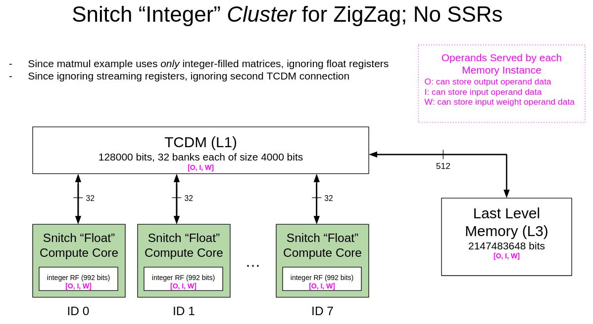
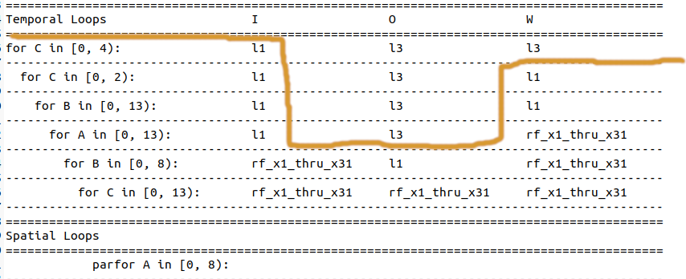

# Matrix Multiplication 13

- This example runs tiled matrix multiplication on a snitch cluster of 8 compute cores.
- Tiling scheme is chosen by ZigZag using a [snitch cluster](https://github.com/EmilySillars/zigzag/blob/manual-examples/zigzag/inputs/hardware/snitch-cluster-only-integers.yaml) hardware description.
- Dynamically Allocated Input
- Matrix size 104 x 104

[back to all tests](../../../zigzag-fork/README.md#Examples)

## I. Input to ZigZag

#### a. MLIR (someday, use linalg-to-stream tool to convert to yaml...)

```
func.func @simple_matmul(%arg0: memref<104x104xi8>, %arg1: memref<104x104xi8>, %arg2: memref<104x104xi32>) {
linalg.matmul ins(%arg0, %arg1 : memref<104x104xi8>, memref<104x104xi8>) outs(%arg2 : memref<104x104xi32>)
return
}
```

Print in generic MLIR syntax with `--mlir-print-op-generic`

```
#map = affine_map<(d0, d1, d2) -> (d0, d2)>
#map1 = affine_map<(d0, d1, d2) -> (d2, d1)>
#map2 = affine_map<(d0, d1, d2) -> (d0, d1)>
"builtin.module"() ({
  "func.func"() ({
  ^bb0(%arg0: memref<104x104xi8>, %arg1: memref<104x104xi8>, %arg2: memref<104x104xi32>):
    "linalg.matmul"(%arg0, %arg1, %arg2) ({
    ^bb0(%arg3: i8, %arg4: i8, %arg5: i32):
      %0 = "arith.extsi"(%arg3) : (i8) -> i32
      %1 = "arith.extsi"(%arg4) : (i8) -> i32
      %2 = "arith.muli"(%0, %1) : (i32, i32) -> i32
      %3 = "arith.addi"(%arg5, %2) : (i32, i32) -> i32
      "linalg.yield"(%3) : (i32) -> ()
    }) {linalg.memoized_indexing_maps = [#map, #map1, #map2], operand_segment_sizes = array<i32: 2, 1>} : (memref<104x104xi8>, memref<104x104xi8>, memref<104x104xi32>) -> ()
    "func.return"() : () -> ()
  }) {function_type = (memref<104x104xi8>, memref<104x104xi8>, memref<104x104xi32>) -> (), sym_name = "simple_matmul"} : () -> ()
}) : () -> ()
```

Lower specific linalg operation to linalg generic operation with `-linalg-generalize-named-ops`

```
#map = affine_map<(d0, d1, d2) -> (d0, d2)>
#map1 = affine_map<(d0, d1, d2) -> (d2, d1)>
#map2 = affine_map<(d0, d1, d2) -> (d0, d1)>
"builtin.module"() ({
  "func.func"() ({
  ^bb0(%arg0: memref<104x104xi8>, %arg1: memref<104x104xi8>, %arg2: memref<104x104xi32>):
    "linalg.generic"(%arg0, %arg1, %arg2) ({
    ^bb0(%arg3: i8, %arg4: i8, %arg5: i32):
      %0 = "arith.extsi"(%arg3) : (i8) -> i32
      %1 = "arith.extsi"(%arg4) : (i8) -> i32
      %2 = "arith.muli"(%0, %1) : (i32, i32) -> i32
      %3 = "arith.addi"(%arg5, %2) : (i32, i32) -> i32
      "linalg.yield"(%3) : (i32) -> ()
    }) {indexing_maps = [#map, #map1, #map2], iterator_types = [#linalg.iterator_type<parallel>, #linalg.iterator_type<parallel>, #linalg.iterator_type<reduction>], operand_segment_sizes = array<i32: 2, 1>} : (memref<104x104xi8>, memref<104x104xi8>, memref<104x104xi32>) -> ()
    "func.return"() : () -> ()
  }) {function_type = (memref<104x104xi8>, memref<104x104xi8>, memref<104x104xi32>) -> (), sym_name = "simple_matmul"} : () -> ()
}) : () -> ()
```

Add MLIR-C interface attribute to the matmul function:

```
#map = affine_map<(d0, d1, d2) -> (d0, d2)>
#map1 = affine_map<(d0, d1, d2) -> (d2, d1)>
#map2 = affine_map<(d0, d1, d2) -> (d0, d1)>
"func.func"() <{function_type = (memref<104x104xi8>, memref<104x104xi8>, memref<104x104xi32>) -> (), sym_name = "regular_matmul"}>  ({
  ^bb0(%arg0: memref<104x104xi8>, %arg1: memref<104x104xi8>, %arg2: memref<104x104xi32>):
    "linalg.generic"(%arg0, %arg1, %arg2) ({
    ^bb0(%arg3: i8, %arg4: i8, %arg5: i32):
      %0 = "arith.extsi"(%arg3) : (i8) -> i32
      %1 = "arith.extsi"(%arg4) : (i8) -> i32
      %2 = "arith.muli"(%0, %1) : (i32, i32) -> i32
      %3 = "arith.addi"(%arg5, %2) : (i32, i32) -> i32
      "linalg.yield"(%3) : (i32) -> ()
    }) {indexing_maps = [#map, #map1, #map2], iterator_types = [#linalg.iterator_type<parallel>, #linalg.iterator_type<parallel>, #linalg.iterator_type<reduction>], operand_segment_sizes = array<i32: 2, 1>} : (memref<104x104xi8>, memref<104x104xi8>, memref<104x104xi32>) -> ()
    "func.return"() : () -> ()
  }) {llvm.emit_c_interface} : () -> ()
```


#### b. Equivalent yaml Workload Object (directly passed to zigzag)

```
- id: 0 
  name: matmul_104_104  # name can be used to specify mapping
  operator_type: MatMul  # operator_type can be used to specify mapping
  equation: O[a][b]+=I[a][c]*W[c][b]
  dimension_relations: []
  loop_dims: [A,B,C]
  loop_sizes: [104, 104, 104]
  operand_precision:
    W: 8
    I: 8
    O: 32
    O_final: 32
  operand_source:
    I: 0
    W: 0
```

#### c. C-ish pseudocode Equivalent (cannot feed to zigzag; just for reference)

```
for (a = 0; a < 104; a++){
	for (b = 0; b < 104; b++) {
		for (c = 0; c < 104; c++) {
			output[a][b] += input[a][c] weights[c][b];		
		}
	}
}
```

#### d. Hardware Description



- [This is the yaml fed to ZigZag](https://github.com/EmilySillars/zigzag/blob/manual-examples/zigzag/inputs/hardware/snitch-cluster-only-integers.yaml)

- Full documentation of feeding to ZigZag and getting output [here](https://github.com/EmilySillars/zigzag/blob/manual-examples/modeling-snitch-with-zigzag.md).

## II. Output from ZigZag

```
Loop ordering for matmul_104_104
===========================================================================================
Temporal Loops                    I                  O                  W                  
===========================================================================================
for C in [0, 4):                  l1                 l3                 l3                 
-------------------------------------------------------------------------------------------
  for C in [0, 2):                l1                 l3                 l1                 
-------------------------------------------------------------------------------------------
    for B in [0, 13):             l1                 l3                 l1                 
-------------------------------------------------------------------------------------------
      for A in [0, 13):           l1                 l3                 rf_x1_thru_x31     
-------------------------------------------------------------------------------------------
        for B in [0, 8):          rf_x1_thru_x31     l1                 rf_x1_thru_x31     
-------------------------------------------------------------------------------------------
          for C in [0, 13):       rf_x1_thru_x31     rf_x1_thru_x31     rf_x1_thru_x31     
-------------------------------------------------------------------------------------------
===========================================================================================
Spatial Loops                                                                              
===========================================================================================
            parfor A in [0, 8):                                                            
-------------------------------------------------------------------------------------------
```




## III. Manual Transformation

recall:

```
// recall:  O[a][b]+=I[a][c]*W[c][b]
===========================================================================================
Temporal Loops                     I                  O                  W                  
===========================================================================================
for c2 in [0, 4):                  l1                 l3                 l3                  C2 = 4
-------------------------------------------------------------------------------------------
  for c1 in [0, 2):                l1                 l3                 l1                  C1 = 2
-------------------------------------------------------------------------------------------
    for b1 in [0, 13):             l1                 l3                 l1                  B1 = 13
-------------------------------------------------------------------------------------------
      for a1 in [0, 13):           l1                 l3                 rf_x1_thru_x31      A1 = 13
-------------------------------------------------------------------------------------------
        for b0 in [0, 8):          rf_x1_thru_x31     l1                 rf_x1_thru_x31      B0 = 8
-------------------------------------------------------------------------------------------
          for c0 in [0, 13):       rf_x1_thru_x31     rf_x1_thru_x31     rf_x1_thru_x31      C0 = 13
-------------------------------------------------------------------------------------------
===========================================================================================
Spatial Loops                                                                              
===========================================================================================
            parfor a0 in [0, 8):                                                             A0 = 8    
-------------------------------------------------------------------------------------------
```

#### a. C-ish pseudocode based on "host-accelerator divide" / "L3-L1 divide"

```
DMAcore(input, weight, output){
	a1_bk_sz = 8
	b1_bk_sz = 8
    c1_bk_sz = 13
    c2_bk_sz = 26	
	// copy all input from L3 to L1;
    for (c2 = 0; c2 < 4; c2++){
        // copy weight tile from L3 to L1
        copyFromL3toL1(weight[c2*c2_bk_sz][0], shape[c2_bk_sz][104])
        for(c1 = 0; c1 < 2; c1++){
            for(b1 = 0; b1 < 13; b1++){
                for (a1 = 0; a1 < 13; a1++) {
                    // copy output tile from L3 to L1.
                    copyFromL3toL1(output[a1*a1_bk_sz][b1*b1_bk_sz], shape[a1_bk_sz][b1_bk_sz])
                    for (coreID = 0; coreID < 8; coreID ++) {
                        dispatchToComputeCore(coreID);    
                    }
                    waitForAllComputeCores();
                    // copy output tile from L1 to L3.
                    copyFromL1toL3(output[a1*a1_bk_sz][b1*b1_bk_sz], shape[a1_bk_sz][b1_bk_sz])
                }
            }
        }
    }
}

computeCore(a1, b1, c1, c2, a1_bk_sz, b1_bk_sz, c1_bk_sz, c2_bk_sz, inputTile, weightTile, outputTile){
	b0_bk_sz = b1_bk_sz / 8;
	c0_bk_sz = c1_bk_sz / 13;
	a0_bk_sz =  a1_bk_sz / 8;
    for (b0 = 0; b0 < 8; b0++) {
        for (c0 = 0; c0 < 13; c0++) {
            a0 = computeCoreID();
            o_a = a0*a0_bk_sz;
            o_b = b0*b0_bk_sz;
            i_a = a1*a1_bk_sz + a0*a0_bk_sz;
            i_c = c2*c2_bk_sz + c1*c1_bk_sz + c0*c0_bk_sz;
            w_c = c1*c1_bk_sz + c0*c0_bk_sz;
            w_b = b1*b1_bk_sz + b0*b0_bk_sz;
            // update output cell.
            outputTile[o_a][o_b] += inputTile[i_a][i_c] * weightTile[w_c][w_b]
        }
    }
}
```

#### b. MLIR Equivalent

Host:

```
"func.func"() <{function_type = 
    (index,                                             // coreID
    memref<104x104xi8, strided<[104, 1], offset: ?>>,   // input L3
    memref<104x104xi8, strided<[104, 1], offset: ?>>,   // weight L3
    memref<104x104xi32, strided<[104, 1], offset: ?>>,  // output L3
    memref<104x104xi8, strided<[104, 1], offset: ?>>,    // input L1
    memref<104x104xi8, strided<[104, 1], offset: ?>>,   // weight L1
    memref<8x8xi32, strided<[8, 1], offset: ?>>)    // output L1
    -> (), sym_name = "dmaCore"}> ({
  ^bb0(%coreID : index,
       %input: memref<104x104xi8, strided<[104, 1], offset: ?>>, 
       %weight: memref<104x104xi8, strided<[104,1], offset: ?>>, 
       %output: memref<104x104xi32, strided<[104,1], offset: ?>>, 
       %inputL1: memref<104x104xi8, strided<[104,1], offset: ?>>,
       %weightL1: memref<104x104xi8, strided<[104,1], offset: ?>>,
       %slice_O_L1: memref<8x8xi32, strided<[8,1], offset: ?>>): 

      // indices
      %zero = arith.constant 0 : index
      %one = arith.constant 1 : index
      %four = arith.constant 4 : index
      %two = arith.constant  2 : index
      %eight = arith.constant  8 : index
      %thirteen = arith.constant 13 : index  
      // tile sizes
      %a1_bk_sz = arith.constant 8 : index
      %b1_bk_sz = arith.constant 8 : index
      %c1_bk_sz = arith.constant 13 : index
      %c2_bk_sz = arith.constant 26 : index
      %b0_bk_sz = arith.constant 1 : index
      %c0_bk_sz = arith.constant 1 : index
      %a0_bk_sz = arith.constant 1 : index
      // constants
      %sixTwentyFour = arith.constant 624: index
      %three = arith.constant 3: i8
      %nine = arith.constant 9: i8

      // copy input from L3 to L1
      func.call @memrefCopy8bit_I_104x104(%input,  %inputL1) 
      : (memref<104x104xi8, strided<[104, 1], offset: ?>>, memref<104x104xi8, strided<[104, 1], offset: ?>>) -> ()
     

      // FOR LOOPS START HERE
      scf.for %c2 = %zero to %four step %one iter_args() -> () {

      // select 26 x 104 subview of L3 weight matrix
      %slice_W_L3_offset = arith.muli %c2, %c2_bk_sz : index
      %slice_W_L3 = memref.subview %weight[%slice_W_L3_offset, %zero][26,104][1,1]
      :  memref<104x104xi8, strided<[104,1], offset: ?>> to memref<26x104xi8, strided<[104,1], offset: ?>>      
      
      // select 26 x 104 subview of L1 weight matrix
      %slice_W_L1 = memref.subview %weightL1[%zero, %zero][26,104][1,1] // is this offset correct?
      :  memref<104x104xi8, strided<[104,1], offset: ?>> to memref<26x104xi8, strided<[104,1], offset: ?>>
      
      // copy weights from L3 to L1
      func.call @memrefCopy8bit_W_26x104( %slice_W_L3, %slice_W_L1)
      : (memref<26x104xi8, strided<[104, 1], offset: ?>>,memref<26x104xi8, strided<[104, 1], offset: ?>>) -> ()

      scf.for %c1 = %zero to %two step %one iter_args() -> () {
      scf.for %b1 = %zero to %thirteen step %one iter_args() -> () {
      scf.for %a1 = %zero to %thirteen step %one iter_args() -> () {
      
      // select 8x8 subview of L3 output matrix
      %slice_O_L3_offset_r = arith.muli %a1, %a1_bk_sz : index
      %slice_O_L3_offset_c = arith.muli %b1, %b1_bk_sz : index
      %slice_O_L3 = memref.subview %output[%slice_O_L3_offset_r,%slice_O_L3_offset_c][8,8][1,1]
      : memref<104x104xi32, strided<[104, 1], offset: ?>>  to  memref<8x8xi32, strided<[104, 1], offset: ?>>
      
      // copy output tile 8x8 from L3 to L1.
      func.call @memrefCopy32bit_O_8x8_down(%slice_O_L3, %slice_O_L1)
      : (memref<8x8xi32, strided<[104, 1], offset: ?>>, memref<8x8xi32, strided<[8, 1], offset: ?>>) -> ()
      
      // after this point, the computation should be dispatched to compute cores.
      func.call @save_outer_loop_counters(%a1,%b1,%c1,%c2,%a1_bk_sz,%b1_bk_sz,%c1_bk_sz,%c2_bk_sz)
      : (index,index,index,index,index,index,index,index) -> ()

      scf.for %a0 = %zero to %eight step %one iter_args() -> () { // spatial unrolling loop

      func.call @dispatch_to_accelerator(%a0, %inputL1, %slice_W_L1, %slice_O_L1)
      : (
          index, 
          memref<104x104xi8, strided<[104, 1], offset: ?>>,  // input
          memref<26x104xi8, strided<[104, 1], offset: ?>>,   // weight slice
          memref<8x8xi32, strided<[8, 1], offset: ?>>)       // output slice
      -> ()
      } // end of spatial unrolling loop  

      func.call @wait_for_all_accelerators() : () -> ()

      // copy L1 output tile back to L3 
      func.call @memrefCopy32bit_O_8x8_up(%slice_O_L1, %slice_O_L3)
      : (memref<8x8xi32, strided<[8, 1], offset: ?>>, memref<8x8xi32, strided<[104, 1], offset: ?>>) -> ()      
      }}}  
      }      
  "func.return"() : () -> ()
  }) {llvm.emit_c_interface}: () -> ()
```

Accelerator:

```
 "func.func"() <{function_type = (
    memref<104x104xi8, strided<[104, 1], offset: ?>>,  // input
    memref<26x104xi8, strided<[104, 1], offset: ?>>,   // weight slice
    memref<8x8xi32, strided<[8, 1], offset: ?>>,       // output slice
    index,index,index,index,index,index,index,index)  
    -> (), sym_name = "computeCore"}> ({
  ^bb0(
    %slice_I_L1: memref<104x104xi8, strided<[104, 1], offset: ?>>, 
    %slice_W_L1: memref<26x104xi8, strided<[104, 1], offset: ?>>, 
    %slice_O_L1: memref<8x8xi32, strided<[8, 1], offset: ?>>,
    %a1 : index, 
    %b1 : index, 
    %c1 : index, 
    %c2 : index, 
    %a1_bk_sz_fooey : index, 
    %b1_bk_sz_fooey : index, 
    %c1_bk_sz_fooey : index, 
    %c2_bk_sz_fooey : index
    ):

    // indices
      %zero = arith.constant 0 : index
      %one = arith.constant 1 : index
      %four = arith.constant 4 : index
      %two = arith.constant  2 : index
      %eight = arith.constant  8 : index
      %thirteen = arith.constant 13 : index  
      // tile sizes
      %a1_bk_sz = arith.constant 8 : index
      %b1_bk_sz = arith.constant 8 : index
      %c1_bk_sz = arith.constant 13 : index
      %c2_bk_sz = arith.constant 26 : index
      %b0_bk_sz = arith.constant 1 : index
      %c0_bk_sz = arith.constant 1 : index
      %a0_bk_sz = arith.constant 1 : index
      // constants
      %sixTwentyFour = arith.constant 624: index
      %three = arith.constant 3: i8
      %nine = arith.constant 9: i8

    %a0 = func.call @myID() : () -> (index) // spacial unrolling of a0
    scf.for %b0 = %zero to %eight step %one iter_args() -> () { 
    scf.for %c0 = %zero to %thirteen step %one iter_args() -> () {

      // index calculation
      %a_prod_0 = arith.muli %a0, %a0_bk_sz : index 
      %a_prod_1 = arith.muli %a1, %a1_bk_sz : index 
      %b_prod_0 = arith.muli %b0, %b0_bk_sz : index 
      %b_prod_1 = arith.muli %b1, %b1_bk_sz : index 
      %c_prod_0 = arith.muli %c0, %c0_bk_sz : index
      %c_prod_1 = arith.muli %c1, %c1_bk_sz : index
      %c_prod_2 = arith.muli %c2, %c2_bk_sz : index
      %c_sum_2_1 = arith.addi %c_prod_2, %c_prod_1 : index
      // indices into weight matrix slice
      %w_c = arith.addi %c_prod_1, %c_prod_0 : index 
      %w_b = arith.addi %b_prod_1, %b_prod_0 : index
      // indices into output matrix slice
      %o_a = arith.muli %a0, %a0_bk_sz : index 
      %o_b = arith.muli %b0, %b0_bk_sz : index 
      // indices into input matrix slice
      %i_a = arith.addi %a_prod_1, %a_prod_0 : index
      %i_c = arith.addi %c_sum_2_1, %c_prod_0 : index

      // load the input element
      %inputElt = memref.load %slice_I_L1[%i_a, %i_c] : memref<104x104xi8, strided<[104, 1], offset: ?>>
      %inputEltCasted = arith.extsi  %inputElt : i8 to i32 

      // load the weight element
      %weightElt = memref.load %slice_W_L1[%w_c, %w_b] : memref<26x104xi8, strided<[104,1], offset: ?>>
      %weightEltCasted = arith.extsi  %weightElt : i8 to i32 

      // load the output element
      %outputElt = memref.load %slice_O_L1[%o_a, %o_b] : memref<8x8xi32, strided<[8, 1], offset: ?>>  
      
      // perform the multiply-accumulate operation
      %prod = arith.muli %inputEltCasted, %weightEltCasted : i32
      %newOutputElt = arith.addi %prod, %outputElt : i32

      // update the L1 output tile with the newly computed value
      memref.store %newOutputElt, %slice_O_L1[%o_a, %o_b] : memref<8x8xi32, strided<[8, 1], offset: ?>>
    }
    }
    "func.return"() : () -> ()
  }) {llvm.emit_c_interface}: () -> ()
```

## IV. Run the example

1. `cd runtime/tests`
2. `. regression-tests.sh -t tiledMatmul12.mlir`

## V. Run the example outside of the test suite

```
cd runtime/tests
```

spike: 

```
. zigzag-spike-build-and-run.sh tiledMatmul13.mlir
```

verilator:

```
. zigzag-verilator-build-and-run.sh tiledMatmul13.mlir
```

