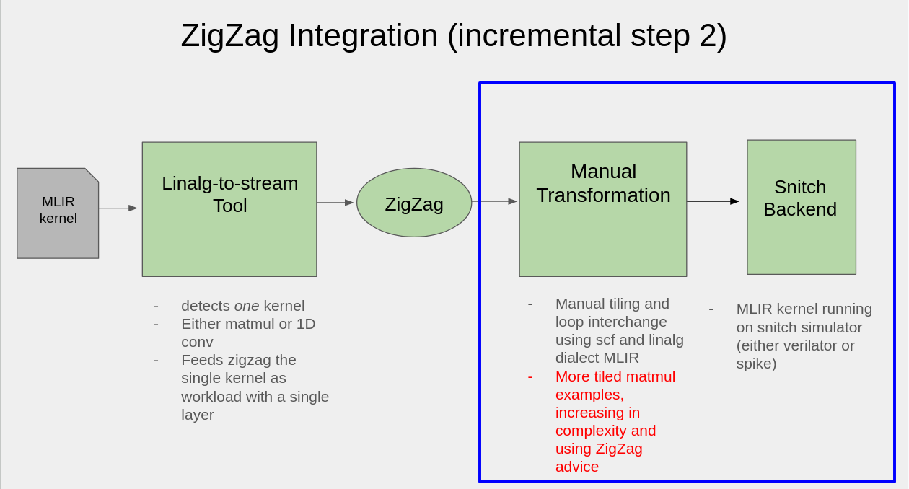

# Quidditch-Zigzag Forked Repo

Run and Test MLIR examples with *Verilator and Spike Simulating Snitch*.

##### Current Status

- this repo deals with everything inside the blue box
- red text means WIP/next steps
- Check [ZigZig Integration Status Slides](https://docs.google.com/presentation/d/1-YQwx20RkEFZoqrMr_WQOjtFaXDR8e_lfNbEfbl83HA/edit?usp=sharing) for more info



## Examples

*Before doing anything, remember to [set your environment variables correctly](#Setup), either manually or by editing [setup.sh]([./setup.sh](https://github.com/EmilySillars/Quidditch-zigzag/blob/manual-transformations/zigzag-fork/setup.sh))* and then running `. setup.sh` 

```
cd runtime/tests
```

#### Snitch DMA Core + 1 Compute Core

| Test + Description                                           | Matrix Size | Allocation | Values | Tiling Method                                                | Verilator | Spike |
| :----------------------------------------------------------- | ----------- | ---------- | ------ | ------------------------------------------------------------ | --------- | ----- |
| **Tiled Matrix Multiplication 6**<br />```sh zigzag-spike-build-and-run.sh tiledMatmul6.mlir```<br /><br />Dispatches to compute core!<br />Full details [here](../runtime/tests/tiledMatmul6/README.md) | 104 x 104   | dynamic    | Fixed  | ZigZag w/ [gemm](https://github.com/KULeuven-MICAS/zigzag/blob/f53a6bf98b6eb4d4a592d3c5b1bf9cc6cce2eadc/zigzag/inputs/examples/hardware/Gemm.py) | TODO      | yes   |
| **Tiled Matrix Multiplication 10**<br />```sh zigzag-spike-build-and-run.sh tiledMatmul6.mlir```<br /><br />Dispatches to compute core!<br />Uses MLIR Subviews!<br /> Full details [here](../runtime/tests/tiledMatmul10/README.md) | 104 x 104   | dynamic    | Fixed  | ZigZag w/ [gemm](https://github.com/KULeuven-MICAS/zigzag/blob/f53a6bf98b6eb4d4a592d3c5b1bf9cc6cce2eadc/zigzag/inputs/examples/hardware/Gemm.py) | TODO      | TODO  |

#### Snitch DMA Core only

| Test + Description                                           | Matrix Size | Allocation | Values | Tiling Method                                                | Verilator  | Spike      |
| :----------------------------------------------------------- | ----------- | ---------- | ------ | ------------------------------------------------------------ | ---------- | ---------- |
| **Hola World**<br />```sh zigzag-spike-build-and-run.sh holaWorld.mlir```<br />Full details [here](../runtime/tests/holaWorld/README.md) | n/a         | static     | Fixed  | n/a                                                          | yes        | yes        |
| **Matrix Multiplication**<br />```sh zigzag-verilator-build-and-run.sh matmul.mlir```<br />Full details [here](../runtime/tests/matmul/README.md) | 16 x 16     | static     | Fixed  | n/a                                                          | yes        | yes        |
| **Tiled Matrix Multiplication**<br />```sh zigzag-spike-build-and-run.sh tiledMatmul.mlir```<br />Full details [here](../runtime/tests/tiledMatmul/README.md) | 16 x 16     | static     | Fixed  | 2x16 and 16x2                                                | yes (slow) | yes        |
| **Tiled Matrix Multiplication 2**<br />```sh zigzag-spike-build-and-run.sh tiledMatmul2.mlir```<br />Full details [here](../runtime/tests/tiledMatmul2/README.md) | 16 x 16     | static     | Fixed  | ZigZag w/ [gemm](https://github.com/KULeuven-MICAS/zigzag/blob/f53a6bf98b6eb4d4a592d3c5b1bf9cc6cce2eadc/zigzag/inputs/examples/hardware/Gemm.py) | yes (slow) | yes        |
| **Tiled Matrix Multiplication 3**<br />```sh zigzag-spike-build-and-run.sh tiledMatmul3.mlir```<br />Full details [here](../runtime/tests/tiledMatmul3/README.md) | 16 x 16     | dynamic    | Fixed  | ZigZag w/ [gemm](https://github.com/KULeuven-MICAS/zigzag/blob/f53a6bf98b6eb4d4a592d3c5b1bf9cc6cce2eadc/zigzag/inputs/examples/hardware/Gemm.py) | yes (slow) | yes        |
| ~~Tiled Matrix Multiplication 4~~<br />```sh zigzag-spike-build-and-run.sh tiledMatmul4.mlir```<br />Full details [here](../runtime/tests/tiledMatmul4/README.md) | 17 x 17     | dynamic    | Fixed  | ZigZag w/ [gemm](https://github.com/KULeuven-MICAS/zigzag/blob/f53a6bf98b6eb4d4a592d3c5b1bf9cc6cce2eadc/zigzag/inputs/examples/hardware/Gemm.py) | ***TODO*** | ***TODO*** |
| **Tiled Matrix Multiplication 5**<br />```sh zigzag-spike-build-and-run.sh tiledMatmul5.mlir```<br />Full details [here](../runtime/tests/tiledMatmul5/README.md) | 104 x 104   | dynamic    | Fixed  | ZigZag w/ [gemm](https://github.com/KULeuven-MICAS/zigzag/blob/f53a6bf98b6eb4d4a592d3c5b1bf9cc6cce2eadc/zigzag/inputs/examples/hardware/Gemm.py) | TODO       | yes        |
| tbd 7                                                        |             |            |        |                                                              | ***TODO*** | ***TODO*** |
| tbd 8                                                        |             |            |        |                                                              | ***TODO*** | ***TODO*** |
| ~~*Tiled Matrix Multiplication 9*~~<br />```sh zigzag-spike-build-and-run.sh tiledMatmul9.mlir```<br />Full details [here](../runtime/tests/tiledMatmul9/README.md) | 600x600     | dynamic    | Fixed  | ZigZag w/ [gemm](https://github.com/KULeuven-MICAS/zigzag/blob/f53a6bf98b6eb4d4a592d3c5b1bf9cc6cce2eadc/zigzag/inputs/examples/hardware/Gemm.py) | ***TODO*** | ***TODO*** |

## Setup

### 1. Set up the Quidditch repo

1. Clone the repo with `--recursive` option: 

   ```
   git clone --recursive https://github.com/EmilySillars/Quidditch-zigzag.git
   ```

2. ````
   cd Quidditch-zigzag
   mkdir ./toolchain
   ````

3. ```
   sudo chmod 666 /var/run/docker.sock
   docker run --rm ghcr.io/opencompl/quidditch/toolchain:main tar -cC /opt/quidditch-toolchain . | tar -xC ./toolchain
   ```

4. Install python requirements:

   ```
   python -m pip install -r runtime/requirements.txt
   ```

5. Install blender: 

   ```
   cargo install bender
   ```

6. ```
   cd runtime && mkdir build
   ```

### 2. Set up Snitch-Specific Spike

1. [clone the repo](https://github.com/opencompl/riscv-isa-sim/tree/CSR-Barrier) and switch to the  `origin/CSR-Barrier` branch:

   ```
   git clone https://github.com/opencompl/riscv-isa-sim.git
   git switch origin/CSR-Barrier
   ```

2. ```
   apt-get install device-tree-compiler libboost-regex-dev
   cd riscv-isa-sim
   mkdir build
   cd build
   ../configure --with-target=riscv32-unknown-elf --with-isa=RV32IMAFD --prefix=/home/hoppip/riscv-isa-sim/build
   make
   make install
   ```

### 3. Set Environment Variables 

Before running any examples,

- remember to add your MLIR LLVM build to your install path, for example:

  ```
  export PATH=/home/hoppip/llvm-project-pistachio/build-riscv/bin:$PATH # for regular mlir-opt
  export PATH=/home/hoppip/llvm-project-17/build-riscv/bin:$PATH        # for mlir-opt-17
  ```

- remember to set the RISCV environment variable to your risc-v toolchain install path, for example:

  ```
  export PATH="/home/hoppip/riscv/bin:$PATH"
  ```

- remember to set the SPIKE environment variable to your spike `riscv-isa-sim` build directory, for example:

  ```
  export SPIKE="/home/hoppip/riscv-isa-sim/build"
  ```

Automate this step by running [setup.sh](setup.sh)

```
. setup.sh
```

## Build + Run + Test

### 1. with Verilator Simulating Snitch (slow, cycle accurate)

1) navigate to the tests directory: `cd runtime/tests`

2) run the following script with the name of the kernel's mlir source file; for example, `holaWorld.mlir`
   ```
   sh zigzag-verilator-build-and-run.sh holaWorld.mlir
   ```

### 2. with Spike Simulating Snitch (faster, not cycle accurate)

1. navigate to the tests directory: `cd runtime/tests`

2. run the following script with the name of the kernel's mlir source file; for example, `holaWorld.mlir`
   ```
   sh zigzag-spike-build-and-run.sh holaWorld.mlir
   ```

## Build + Run + Test (more steps, fewer shell scripts)

1. Run cmake from inside the build directory
   ```
   cd build
   cmake .. -GNinja -DCMAKE_TOOLCHAIN_FILE=../toolchain/ToolchainFile.cmake
   ```

2. Compile the MLIR needed by the test case
   ```
   cd tests
   sh compile-for-riscv.sh <testCaseName.mlir>
   cd .. # return to build directory
   ```

3. Build 

   ```ninja <TestCaseName>
   ninja <TestCaseName>
   ```

4. Run 
   
   a. using verilator: `../../toolchain/bin/snitch_cluster.vlt tests/<TestCaseName>`

   b. using spike: `$SPIKE/spike -m0x10000000:0x40000,0x80000000:0x80000000 --disable-dtb -p9 tests/<TestCaseName> ` 
   
5. Test

   using ctest: `ctest -R <TestCaseName>`

Example:

```
cd build
cmake .. -GNinja -DCMAKE_TOOLCHAIN_FILE=../toolchain/ToolchainFile.cmake
cd ../../../runtime/tests/
sh compile-for-riscv.sh holaWorld.mlir
cd ../../../../
ninja HolaWorld
../../toolchain/bin/snitch_cluster.vlt tests/HolaWorld                                    # verilator
$SPIKE/spike -m0x10000000:0x40000,0x80000000:0x80000000 --disable-dtb -p9 tests/HolaWorld # spike
ctest -R HolaWorld                                                                        # as a test
```

## How does Clang's -O3 Effect ZigZag transformations?

### Prequisites

Make sure to [install GraphViz](https://graphviz.org/download/) to inspect the control flow graphs emitted by opt.

On fedora, do `sudo yum install graphviz`

### Compare Before and After -O3

1. navigate to the tests directory: `cd runtime/tests`

2. run the following script with the name of the kernel's mlir source file, for example, `tiledMatmul5.mlir` and
   the name of the mlir function you would like to compare, for example, `tiled_matmul`

   ```
   sh was-it-all-worth-it.sh tiledMatmul5.mlir tiled_matmul
   ```

   
   
   

## Broken Pieces

### Running on x86 CPU (Reality Check) (segfaults! need to debug!)

1) navigate to the tests directory: `cd runtime/tests`

2) run the following script with the name of the kernel's mlir source file; for example, `holaWorld.mlir`

  ```
sh ../run-w-x86.sh matmul-tiled.mlir
  ```

**Tests Not Working**

- `sh run-w-x86.sh matmul.mlir` (not working! need to fix!)

- `sh run-w-x86.sh matmul-tiled.mlir` (not working! need to fix!)

  

### wfi() in snitch runtime

Cannot seem to wake up compute cores after they call wfi!

Broken Example Programs:

| Tiled Matrix Multiplication 7<br />```sh zigzag-spike-build-and-run.sh tiledMatmul7.mlir```<br /><br />Trying to dispatch to accelerator<br />Full details [here](../runtime/tests/tiledMatmul7/README.md) |         |         |       |                | ***TODO*** | ***TODO*** |
| :----------------------------------------------------------- | ------- | ------- | ----- | -------------- | ---------- | ---------- |
| **Tiled Matrix Multiplication 8**<br />```sh zigzag-spike-build-and-run.sh tiledMatmul8.mlir```<br />Full details [here](../runtime/tests/tiledMatmul8/README.md) | 19 x 19 | dynamic | Fixed | ZigZag w/ gemm | ***TODO*** | ***TODO*** |

# Troubleshooting

- Error:

```
In file included from main.c:1:
In file included from /home/hoppip/llvm-project-pistachio/build-riscv/lib/clang/18/include/stdint.h:52:
In file included from /usr/include/stdint.h:26:
In file included from /usr/include/bits/libc-header-start.h:33:
In file included from /usr/include/features.h:527:
/usr/include/gnu/stubs.h:7:11: fatal error: 'gnu/stubs-32.h' file not found
    7 | # include <gnu/stubs-32.h>
```

Solution:

```
sudo yum install glibc-devel.i686
```

from this link: https://superuser.com/questions/491504/how-do-i-install-package-libc6-dev-i386-on-fedora

- Error:

```
sudo apt-get install device-tree-compiler libboost-regex-dev
Reading package lists... Done
Building dependency tree... Done
E: Unable to locate package device-tree-compiler
E: Unable to locate package libboost-regex-dev

```

Solution:

```
sudo yum install dtc
```

- Error:

```
CMake Error at cmake/quidditch_module.cmake:2 (find_program):
  Could not find IREE_COMPILE_PATH using the following names: iree-compile
Call Stack (most recent call first):
  samples/CMakeLists.txt:2 (include)
```

Solution:

Comment out the contents of `Quidditch-zigzag/runtime/samples/CMakeLists.txt`

- Error about test case you are not interested in running
  ```
  CMake Error at tests/CMakeLists.txt:79 (add_executable):
    Cannot find source file:
  
      tiledMatmul8/out/tiledMatmul8.o
  ```

  Solution:

  ```
  sh compile-all-mlir-tests-for-riscv.sh
  ```

  
