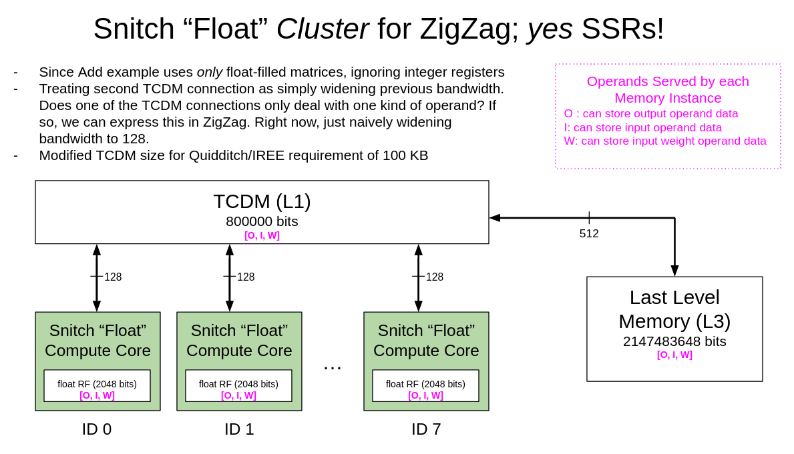

# Worked Example: Apply ZigZag to part of IREE Kernel

Question How can we use ZigZag for the tiling needed by Quidditch's backend?

Related to issue [here](https://github.com/xdslproject/xdsl/issues/2740#issue-2357321245), to clarify bounds input needed [here](https://github.com/opencompl/Quidditch/blob/ceb050e9281560cb789fcfd51b3e6ac91e082248/codegen/compiler/src/Quidditch/Target/ConfigureForSnitch.cpp#L50).

[back to all examples](../README.md#Examples)

## Hardware Description

### 1. Ignoring SSRs


#### As a YAML file for ZigZag

```
name: snitch-riscv32imafd
memories:
  # Representing registers f0 - f31 as a single register file of 2048 bits.
  rf_f0_thru_f31:
    size: 2048
    r_bw: 128 # because RISCV instructions like FADD take two source registers (64 + 64 = 128)
    w_bw: 64
    r_cost: 0.02  # TODO
    w_cost: 0.02  # TODO
    area: 0
    r_port: 1
    w_port: 1
    rw_port: 0
    latency: 1
    auto_cost_extraction: False
    operands: [I1,I2,O]
    ports:
      - fh: w_port_1 # input data FROM L1 can be written to registers
        tl: r_port_1 # input data can be read from registers to give to TO registers
      - fh: w_port_1 # weight data FROM L1 can be written to registers
        tl: r_port_1 # weight data can be read from registers to give to TO registers
      - fh: w_port_1 # output data FROM registers can be written to registers
        tl: r_port_1 # output data can be read from registers to give to TO registers
        th: r_port_1 # output data can be read from registers to give TO L1
    served_dimensions: [] # every core gets a register file, so not serving any dimensions

# TCDM
  l1:
    size: 800000 # adjusted to 100 KB per Markus's request
    r_bw: 64 # because load/store instructions use 64 bit registers
    w_bw: 64 # because load/store instructions use 64 bit registers
    r_cost: 22.9  # TODO # copied from gemm.yaml
    w_cost: 52.01 # TODO # copied from gemm.yaml
    area: 0
    r_port: 0
    w_port: 0
    rw_port: 1 # rw port because we cannot read and write to TCDM in parallel from same core.
    latency: 1
    operands: [I1, I2, O]
    min_r_granularity: 64
    min_w_granularity: 64
    ports:
      - fh: rw_port_1 # input data FROM L3 can be written to L1
        tl: rw_port_1 # input data can be read from L1 to give TO registers
      - fh: rw_port_1 # weight data FROM L3 can be written to L1
        tl: rw_port_1 # weight data can be read from L1 to give TO registers
      - th: rw_port_1 # output data can be read from L1 to give TO L3
        fl: rw_port_1 # output data FROM registers can be written to L1
    served_dimensions: [D1]

# Last level memory
  l3:
    size: 2147483648
    r_bw: 512
    w_bw: 512
    r_cost: 700  # TODO
    w_cost: 750  # TODO
    area: 0
    r_port: 0
    w_port: 0
    rw_port: 1
    latency: 1
    operands: [I1, I2, O]
    ports: # not putting fh or th in here, because L3 treated as highest level memory
      - fl: rw_port_1
        tl: rw_port_1
      - fl: rw_port_1
        tl: rw_port_1
      - tl: rw_port_1
        fl: rw_port_1
    served_dimensions: [D1]

operational_array:
  input_precision: [8, 8]
  multiplier_energy: 0.04 # pJ # copied from gemm.yaml
  multiplier_area: 1 # unit
  dimensions: [D1,D2]
  sizes: [1,8] 
```

### 2. Naively Modeling SSRs



#### As a YAML file for ZigZag

Only difference is r/w bandwidth of TCDM...

```
...
# TCDM
  l1:
    size: 800000 # adjusted to 100 KB per Markus's request
    r_bw: 128 # because load/store instructions use 64 bit registers, and because SSRs enabled, two connections!
    w_bw: 128 # because load/store instructions use 64 bit registers; two connections, so 64 + 64 = 128.
    r_cost: 22.9  # TODO # copied from gemm.yaml
    w_cost: 52.01 # TODO # copied from gemm.yaml
    area: 0
    r_port: 0
    w_port: 0
    rw_port: 1 # rw port because we cannot read and write to TCDM in parallel from same core.
    latency: 1
    operands: [I1, I2, O]
    min_r_granularity: 64
    min_w_granularity: 64
    ports:
      - fh: rw_port_1 # input data FROM L3 can be written to L1
        tl: rw_port_1 # input data can be read from L1 to give TO registers
      - fh: rw_port_1 # weight data FROM L3 can be written to L1
        tl: rw_port_1 # weight data can be read from L1 to give TO registers
      - th: rw_port_1 # output data can be read from L1 to give TO L3
        fl: rw_port_1 # output data FROM registers can be written to L1
    served_dimensions: [D1]
...
```

## Workload

### Original Linalg MLIR

Excerpt from [here](https://gist.github.com/zero9178/ece6b35ccf666a23eb4e1490984c6ac0#file-gistfile1-txt-L15)

```
%10 = linalg.generic {indexing_maps = [
affine_map<(d0, d1) -> (d0, d1)>, 
affine_map<(d0, d1) -> (d0, d1)>, 
affine_map<(d0, d1) -> (d0, d1)>], 
iterator_types = ["parallel", "parallel"]} 
ins(%9, %6 : tensor<1x400xf64>, tensor<1x400xf64>) 
outs(%7 : tensor<1x400xf64>) {
  ^bb0(%in: f64, %in_0: f64, %out: f64):
    %11 = arith.addf %in, %in_0 : f64
    linalg.yield %11 : f64
  } -> tensor<1x400xf64>
```

### In C-ish pseudocode (to make sure we understand the linalg generic)

```
const int D0 = 1;
const int D1 = 400;
void linalgGeneric(Tensor_1x400 i, Tensor_1x400 w, Tensor 1x400 o){
	for (d0 = 0; d0 < D0; d0 ++) {
		for (d1 = 0; d1 < D1; d1 ++) {
			o[d0][d1] = i[d0][d1] + w[d0][d1]		
		}
	}
}
```

### As a YAML file for ZigZag

```
- id: 0
  operator_type: Add
  equation: O[r][c]=I[r][c]+W[r][c]
  dimension_relations: []
  loop_dims: [R,C]
  loop_sizes: [1, 400]
  operand_precision:
    W: 64
    I: 64
    O: 64
    O_final: 64
  operand_source:
    I: 0
    W: 0
```

## Output from ZigZag

More details on running ZigZag with iree kernel input documented [here](https://github.com/EmilySillars/zigzag/blob/187fdcf0cb9726e8480a16e0d6e2e6f8ae659aa9/nsnet-iree-kernel.md)

### 1. Ignoring SSRs

```
python main_iree_kernel_no_ssrs.py
```

Abbreviated Output:

```
Loop ordering for Layer0
=======================================================================================
Temporal Loops                O                  I                  W                  
=======================================================================================
for C in [0, 5):              l1                 l1                 l1                 
---------------------------------------------------------------------------------------
  for C in [0, 5):            rf_f0_thru_f31     rf_f0_thru_f31     rf_f0_thru_f31     
---------------------------------------------------------------------------------------
    for C in [0, 2):          rf_f0_thru_f31     rf_f0_thru_f31     rf_f0_thru_f31     
---------------------------------------------------------------------------------------
=======================================================================================
Spatial Loops                                                                          
=======================================================================================
      parfor C in [0, 8):                                                              
---------------------------------------------------------------------------------------
      parfor C in [0, 1):                                                              
---------------------------------------------------------------------------------------

Stall and slack per port of each memory instance:
  rf_f0_thru_f31: {'r_port_1': 68, 'w_port_1': 30}
  l1: {'rw_port_1': 70}
  l3: {'rw_port_1': 0}
Latency: 3.000e+02
```

Also have output in a json file!

### 2. Naively Modeling SSRs (same tiling recommendation as output from no. 1!)

```
python main_iree_kernel_yes_ssrs.py 
```

Abbreviated Output:

```
Loop ordering for Layer0
=======================================================================================
Temporal Loops                W                  O                  I                  
=======================================================================================
for C in [0, 5):              l1                 l1                 l1                 
---------------------------------------------------------------------------------------
  for C in [0, 5):            rf_f0_thru_f31     rf_f0_thru_f31     rf_f0_thru_f31     
---------------------------------------------------------------------------------------
    for C in [0, 2):          rf_f0_thru_f31     rf_f0_thru_f31     rf_f0_thru_f31     
---------------------------------------------------------------------------------------
=======================================================================================
Spatial Loops                                                                          
=======================================================================================
      parfor C in [0, 8):                                                              
---------------------------------------------------------------------------------------
      parfor R in [0, 1):                                                              
---------------------------------------------------------------------------------------

Stall and slack per port of each memory instance:
  rf_f0_thru_f31: {'r_port_1': 68, 'w_port_1': 30}
  l1: {'rw_port_1': 10}
  l3: {'rw_port_1': 0}
Latency: 2.180e+02
```

Also have output in a json file!

## Tiling Based on ZigZag Recommendations

### In C-ish pseudocode

```
// loop bounds
D1_0 = 5
D1_1 = 5
D1_2 = 2
D1_3 = 8

// bock sizes
d1_0_bk_sz = 80
d1_1_bk_sz = 16
d1_2_bk_sz = 8

// actual tiling
void linalgGeneric(Tensor_1x400 i, Tensor_1x400 w, Tensor 1x400 o){
	for (d1_0 = 0; d1_0 < D1_0; d1_0 ++) {
	 for (d1_1 = 0; d1_1 < D1_1; d1_1 ++) {
	  for (d1_2 = 0; d1_2 < D1_2; d1_2 ++) {
	   for (d1_3 = 0; d1_3 < D1_3; d1_3 ++) {
	    for (d0 = 0; d0 < 1; d0++) {
	     d1 = (d1_0 * d1_bk_sz) + (d1_1 * d1_1_bk_sz) + (d1_2 * d1_2_bk_sz) + d1_3
	     o[d0][d1] = i[d0][d1] + w[d0][d1]	    
	    }
	   }	  
	  }	 		
	 }
	}
}
```

